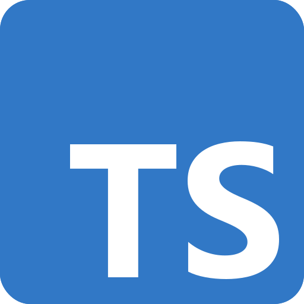

# TypeScript in React - Interactive Learning Guide



A comprehensive, interactive guide to using TypeScript in React applications, covering all the most commonly used TypeScript concepts for modern React development.

## 🌟 Overview

This project is an interactive educational application designed to help developers learn how to effectively use TypeScript with React. It provides detailed explanations, syntax-highlighted code examples, and live demonstrations of various TypeScript features in the context of React development.

Built with React 19, TypeScript 5.8+, and React Router 7, this application itself serves as a real-world example of TypeScript best practices in React.

## 🚀 Live Demo

[View the Live Demo](#) _(Coming soon)_

## ✨ Features

-   **Interactive UI** with side navigation and modern design
-   **Syntax-highlighted code examples** using Prism.js
-   **Working demonstrations** of each concept
-   **Responsive design** for learning on any device
-   **Best practices** for each TypeScript concept

## 📚 Concepts Covered

The application covers the following TypeScript concepts:

1. **Basic Types**: Understanding TypeScript's primitive and complex types
2. **Interfaces & Types**: Creating and using interfaces and type aliases
3. **Function Components**: Different ways to type React Function Components
4. **Props & State**: Typing component props and state
5. **Hooks with TypeScript**: Adding type safety to React hooks
6. **Event Handling**: Working with TypeScript and event handlers
7. **Generics**: Creating reusable, type-safe components with generics
8. **Context API**: Using TypeScript with React's Context API
9. **Utility Types**: Leveraging TypeScript's built-in utility types
10. **Custom Hooks**: Creating reusable, type-safe hooks
11. **Type Assertions**: Understanding when and how to use type assertions
12. **Type Guards**: Implementing type guards for runtime type checking

## 🛠️ Technology Stack

-   **React 19**: Latest version of React
-   **TypeScript 5.8+**: For type-safe JavaScript development
-   **Vite**: For fast development and optimized builds
-   **React Router 7**: For navigation between concept pages
-   **Prism.js**: For syntax highlighting code examples
-   **CSS3**: Modern styling with custom animations

## 🏃‍♀️ Getting Started

### Prerequisites

-   Node.js 16.x or higher
-   npm 7.x or higher

### Installation

1. Clone this repository

    ```bash
    git clone https://github.com/yourusername/react-typescript-concepts.git
    cd react-typescript-concepts
    ```

2. Install dependencies

    ```bash
    npm install
    ```

3. Start the development server

    ```bash
    npm run dev
    ```

4. Open the application in your browser at `http://localhost:5173`

## 📖 Learning Path

This application is designed to be navigated sequentially, from basic concepts to more advanced ones. However, you can jump directly to any topic that interests you using the sidebar navigation.

We recommend starting with Basic Types and gradually moving to more complex concepts like Generics and Type Guards.

## 👥 Contributing

We welcome contributions to improve this learning resource! Whether it's adding new concepts, fixing bugs, or improving documentation.

See [CONTRIBUTING.md](CONTRIBUTING.md) for detailed information on how to contribute to this project.
